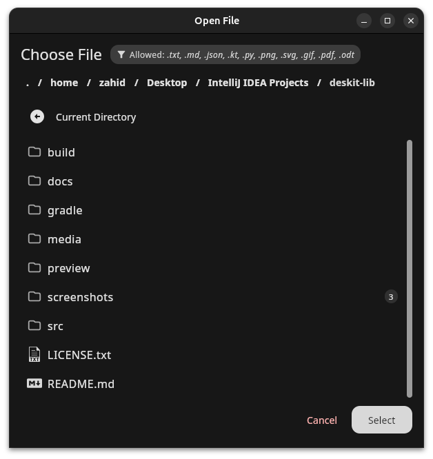
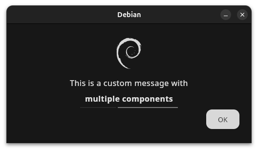
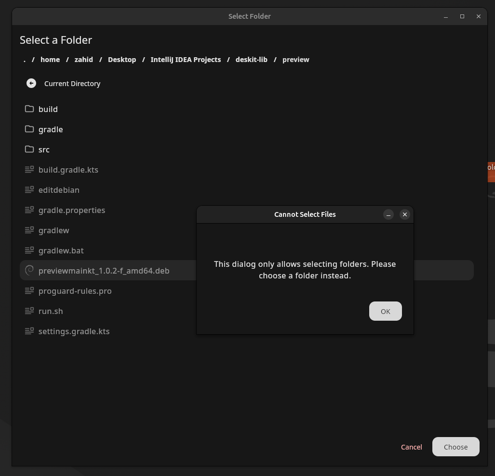
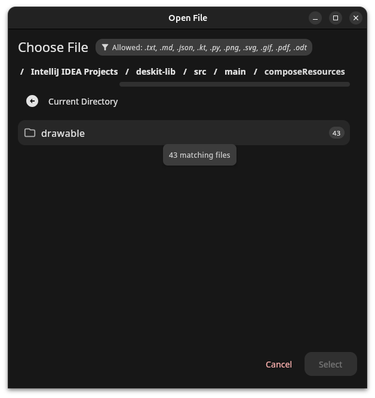
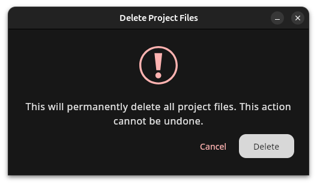

# Deskit

[](https://jitpack.io/#zahid4kh/deskit) [](https://kotlinlang.org/docs/releases.html#release-details) [](https://github.com/JetBrains/compose-jb)

A library for desktop components designed for *Compose for Desktop* applications using Kotlin.

## Table of Contents

- [What's New in 1.2.0](#whats-new-in-120)
    - [Screenshots](#screenshots)
- [Features](#features)
- [Installation](#installation)
    - [Option 1: build.gradle.kts](#option-1-if-you-manage-repositories-in-buildgradlekts)
    - [Option 2: settings.gradle.kts](#option-2-if-you-manage-repositories-in-settingsgradlekts)
- [Quick Start](#quick-start)
    - [File Chooser Dialog](#file-chooser-dialog)
    - [File Saver Dialog](#file-saver-dialog)
    - [Confirmation Dialog](#confirmation-dialog)
    - [Info Dialog](#info-dialog)
    - [Folder Chooser Dialog](#folder-chooser-dialog)
- [Custom Content in Dialogs](#custom-content-in-dialogs)
- [API Documentation](#api-documentation)
- [Requirements](#requirements)
- [License](#license)

## What's New in 1.2.0

- **🖌️ Enhanced Visuals**: Added icon support to InfoDialog and ConfirmationDialog
- **📊 Scrollbars**: All file dialogs now feature horizontal and vertical scrollbars
- **🔍 Smart Folder Navigation**: Folders now show matching file counts in FileChooserDialog
- **🎨 Visual File Types**: Rich file type icons for better user experience
- **📱 Component-Based Architecture**: More maintainable and consistent UI across all dialogs

### Screenshots

*FileChooserDialog showing file type filtering, breadcrumb navigation with scrollbar, and folder matching counts*



*InfoDialog with custom icon and styled message*
```kotlin
InfoDialog(
    title = "Debian",
    icon = painterResource(Res.drawable.debian),
    content = {
        Column(horizontalAlignment = Alignment.CenterHorizontally) {
            Text("This is a custom message with")
            Spacer(Modifier.height(8.dp))
            Text("multiple components", fontWeight = FontWeight.Bold)
            Spacer(Modifier.height(16.dp))
            LinearProgressIndicator(modifier = Modifier.width(200.dp))
        }
    },
    onClose = { showInfoDialog = false }
)
```



*FolderChooserDialog displaying both files (dimmed) and folders with scrollbars*



*FileChooserDialog with badge and tooltip, showing how many files match the required extension*



*ConfirmationDialog with warning icon*
```kotlin
ConfirmationDialog(
    title = "Delete Project Files",
    message = "This will permanently delete all project files. This action cannot be undone.",
    icon = painterResource(Res.drawable.warning),
    colorFilter = ColorFilter.tint(MaterialTheme.colorScheme.error),
    confirmButtonText = "Delete",
    cancelButtonText = "Cancel",
    onConfirm = { showConfirmationDialog = false },
    onCancel = { showConfirmationDialog = false }
)
```



---

## Features

- 🗂️ **File System Dialogs**: Choose files, save files, and select folders - now with scrollbars and smart navigation
- ✅ **Confirmation Dialogs**: User-friendly confirmation prompts with customizable messages and optional icons
- ℹ️ **Information Dialogs**: Clean information display with single-action acknowledgment and custom icons
- 🧭 **Breadcrumb Navigation**: Intuitive path navigation with clickable segments and horizontal scrolling

---

## Installation

### Option 1: If you manage repositories in `build.gradle.kts`

Your module level `build.gradle.kts` should look similar to this:

```kotlin
plugins {
    kotlin("jvm")
    id("org.jetbrains.compose")
    id("org.jetbrains.kotlin.plugin.compose")
}

repositories {
    maven { url = uri("https://jitpack.io") }
    maven("https://maven.pkg.jetbrains.space/public/p/compose/dev")
    mavenCentral()
    google()
}

dependencies {
    implementation(compose.desktop.currentOs)
    implementation("com.github.zahid4kh:deskit:1.2.0")
}

kotlin {
    jvmToolchain(17)
}
```

### Option 2: If you manage repositories in `settings.gradle.kts`

1. Add the JitPack repository to your `settings.gradle.kts` file:

```kotlin
dependencyResolutionManagement {
    repositories {
        maven { url = uri("https://jitpack.io") }
        maven("https://maven.pkg.jetbrains.space/public/p/compose/dev")
        mavenCentral()
        google()
    }
}
```

2. Add the dependency to your `build.gradle.kts` file:

```kotlin
dependencies {
    implementation("com.github.zahid4kh:deskit:1.2.0")
}
```

---

## Quick Start

### File Chooser Dialog

```kotlin
import dialogs.file.FileChooserDialog

@Composable
fun MyApp() {
    var showFileDialog by remember { mutableStateOf(false) }
    var selectedFile by remember { mutableStateOf<File?>(null) }

    Button(onClick = { showFileDialog = true }) {
        Text("Open File")
    }

    if (showFileDialog) {
        FileChooserDialog(
            title = "Select a File",
            allowedExtensions = listOf("txt", "pdf", "md"),
            folderIconColor = MaterialTheme.colorScheme.tertiary, 
            fileIconColor = MaterialTheme.colorScheme.primary,
            onFileSelected = { file ->
                selectedFile = file
                showFileDialog = false
            },
            onCancel = { showFileDialog = false }
        )
    }
}
```

### File Saver Dialog

```kotlin
import dialogs.file.FileSaverDialog

@Composable
fun SaveExample() {
    var showSaveDialog by remember { mutableStateOf(false) }

    Button(onClick = { showSaveDialog = true }) {
        Text("Save File")
    }

    if (showSaveDialog) {
        FileSaverDialog(
            title = "Save Document",
            suggestedFileName = "my-document",
            extension = ".txt",
            onSave = { file ->
                file.writeText("Hello, World!")
                showSaveDialog = false
            },
            onCancel = { showSaveDialog = false }
        )
    }
}
```

### Confirmation Dialog

```kotlin
import dialogs.ConfirmationDialog
import org.jetbrains.compose.resources.painterResource

@Composable
fun ConfirmExample() {
    var showConfirmDialog by remember { mutableStateOf(false) }

    Button(onClick = { showConfirmDialog = true }) {
        Text("Delete Item")
    }

    if (showConfirmDialog) {
        ConfirmationDialog(
            title = "Confirm Deletion",
            message = "Are you sure you want to delete this item?",
            icon = painterResource(Res.drawable.warning),
            confirmButtonText = "Delete", 
            cancelButtonText = "Keep",
            onConfirm = {
                // Perform deletion
                showConfirmDialog = false
            },
            onCancel = { showConfirmDialog = false }
        )
    }
}
```

### Info Dialog

```kotlin
import dialogs.InfoDialog
import org.jetbrains.compose.resources.painterResource

@Composable
fun InfoExample() {
    var showInfoDialog by remember { mutableStateOf(false) }

    if (showInfoDialog) {
        InfoDialog(
            title = "Success",
            message = "Your file has been saved successfully!",
            icon = painterResource(Res.drawable.success), 
            colorFilter = ColorFilter.tint(MaterialTheme.colorScheme.primary),
            onClose = { showInfoDialog = false }
        )
    }
}
```

### Folder Chooser Dialog

```kotlin
import dialogs.file.FolderChooserDialog

@Composable
fun FolderExample() {
    var showFolderDialog by remember { mutableStateOf(false) }

    if (showFolderDialog) {
        FolderChooserDialog(
            title = "Select Export Folder",
            onFolderSelected = { folder ->
                println("Selected: ${folder.absolutePath}")
                showFolderDialog = false
            },
            onCancel = { showFolderDialog = false }
        )
    }
}
```

---

## Custom Content in Dialogs

New in 1.2.0, you can provide custom content to both InfoDialog and ConfirmationDialog:

```kotlin
InfoDialog(
    title = "Custom Content",
    icon = painterResource(Res.drawable.info),
    content = {
        Column(horizontalAlignment = Alignment.CenterHorizontally) {
            Text("This is a custom message with")
            Spacer(Modifier.height(8.dp))
            Text("multiple components", fontWeight = FontWeight.Bold)
            Spacer(Modifier.height(16.dp))
            LinearProgressIndicator(modifier = Modifier.width(200.dp))
        }
    },
    onClose = {  }
)
```

---

## API Documentation

For detailed documentation and examples, visit the [Deskit documentation](https://zahid4kh.github.io/deskit/).

---

## Requirements

- Kotlin 2.1.20+
- Compose Multiplatform 1.7.3+
- JVM 17+

---

## License

This project is licensed under the MIT License - see the [LICENSE](LICENSE.txt) file for details.